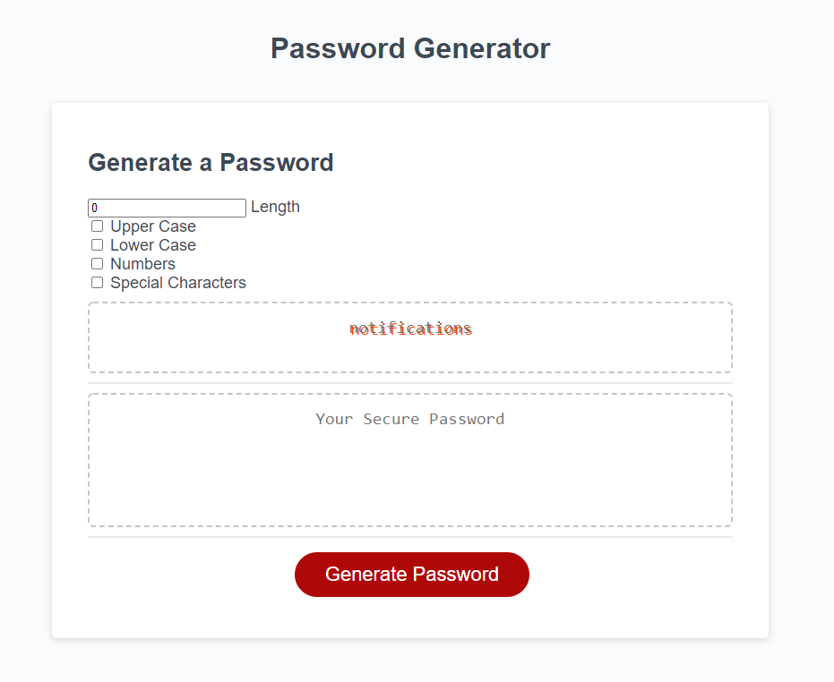

# PasswordGenorator

## *Objective* 
To create a password genorator that takes user inputs for criteria (alphabet ,case, numbers and special characters) then create a randomly genorated password with them.

### Method
i started with a class produced html file of a card layout. then added some areas for user input. Then i wrote javascript code to take those inputs produce a password and display that value on the web page.

 
 
 

### Usage 
this page can be used as a password generator for your password needs.

### Instalation
To make the project work you will need -
* an editor or ide that will save file in the proper types*(html,css,javascript)*  
`Visual Studio or Visual Studio Code` will work great.
* using a version control system you can fork and clone my repo, you could also 
just download the files directly for git hub.

### Deployed website and screenshots

[Link](https://rickycohen88.github.io/PasswordGenorator/)

### Credits
* Trillogy Education

### Contributing
Pull requests are welcome. For major changes, 
please open an issue first to discuss what you would like to change. 
 Please make sure to update tests as appropriate.

### License

    © 